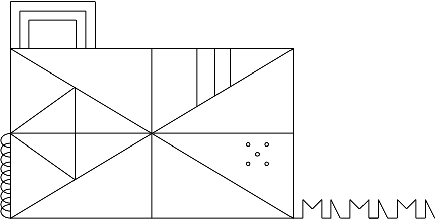

# Colorado Cognitive Assessment (CoCA) Instruction and Scoring Manual

## Table of Contents
**[General Instructions and Scoring Guidelines](#general-instructions-and-scoring-guidelines)** 
**[1. Prospective Memory Test](#1-prospective-memory-test)** 
**[2. Shape Trail Test](#2-shape-trail-test)** 
**[3. Verbal List Learning Test](#3-verbal-list-learning-test)** 
**[4. Figure Copy](#4-figure-copy)** 
**[5. Animal Fluency](#5-animal-fluency)** 
**[6. Lexical Fluency](#6-lexical-fluency)** 
**[7. Test of Working Memory](#7-test-of-working-memory)** 
**[8. Test of Focused Attention](#8-test-of-focused-attention)** 
**[9. Clock Command](#9-clock-command)** 
**[10. Clock Copy](#10-clock-copy)** 
**[11. Similarities](#11-similarities)** 
**[12. Number Symbol Matching Test](#12-number-symbol-matching-test)** 
**[13. Verbal Naming Test](#13-verbal-naming-test)** 
**[14. Orientation](#14-orientation)** 
**[15. Verbal List Learning Delayed Recall](#15-verbal-list-learning-delayed-recall)** 
**[16. Verbal List Learning Yes/No Recognition](#16-verbal-list-learning-yesno-recognition)** 
**[17. Verbal List Learning Forced Choice Recognition](#17-verbal-list-learning-forced-choice-recognition)** 
**[18. Figure Delayed Recall](#18-figure-delayed-recall)** 
**[19. Prospective Memory Test Delayed Recall](#19-prospective-memory-test-delayed-recall)** 
**[20. Test of Functional Abilities](#20-test-of-functional-abilities)** 
**[Scoring](#scoring-17)** 
**[License](#license)** 

## General Instructions and Scoring Guidelines

The CoCA is made up of 20 items. Items have a total score and various process scores. Item scores are combined using a CFA model to arrive at the CoCA global z-score. There is an additional supplement to assist with scoring of process variables. Process variables are not reflected in the global score of the CoCA. Specific process variables are identified for items; the examiner can use the process variables supplement to indicate the presence and number of item-specific qualitative features.

In general, each correct response receives one point unless otherwise specified. Items that are not scored are indicated as such in this manual and their scoring sections are greyed out on the CoCA.

Examiners are encouraged not to affirm or respond to examinee’s responses. If the examinee makes a mistake, do not correct them, unless otherwise specified.

No additional materials besides a pen and a stopwatch are needed for the CoCA. All stimulus materials needed for administration of the CoCA are available as supplemental pages. Please try and record examinee’s responses verbatim as much as possible.

## 1. Prospective Memory Test

### Materials Needed

None

### Instructions

*Suppose you have to look at a bank statement in a little while. When I say that the test is over, I want you to remind me that you have to look a bank statement.*

### Scoring

This item is not scored

(If examinee reminds you about looking at bank statement after the shape trail test, restate instructions and emphasize that the reminder only has to occur when the examiner states that the test is over.)

## 2. Shape Trail Test

Adapted from [Zhao et al., 2013](https://dx.doi.org/10.1371%2Fjournal.pone.0057333)

### Materials Needed

[Supplement 1](https://github.com/begavett/CoCA/blob/master/Supplements/Supplement1.pdf) and stopwatch

### Instructions

*Here* (point to stimulus), *you see numbers in circles and squares. I want you to draw a line from 1 in the square to the 2 in the circle to the 3 in the square* (keep pointing) *and just like that alternating between square and circle in ascending order of the numbers till you reach the end here* (point). *You will have two minutes. Ready? Go!*

### Scoring

- Global
  - Total time (seconds)
  - Number of correct lines
    - Maximum number of correct lines is 7
- Process
  - Sequencing error
  - Set loss error
  - Capture error
  - Visuospatial neglect
  - Visual difficulties
  - Motor difficulties/tremors
  - Losing track and starting from wrong target

## 3. Verbal List Learning Test

### Materials Needed

None. 

### Instructions

*I am going to read you a list of words. When I am done, I want you to tell me all the words you remember, in any order. Ready?* (read list at 1 word per second). *Now, tell me all the words you remember.*

Repeat twice: *I am going to read you the same list of words one more time. When I am done, tell me all the words you remember, including the ones you have already told me before. You can tell me the words in any order.*

- Car 
- River 
- Market 
- Desk 
- Foot 
- Square
- Teacher 

At the end of the test: *Try and keep these words in mind because you may be asked about them at the end of the test.*

### Scoring

- Global
  - 1 point for each word correctly recalled in each trial for a maximum of 21 points across all three learning trials
- Process
  - Intrusions
  - Semantic
  - Phonemic
  - Novel
  - Repetitions

## 4. Figure Copy 

### Materials Needed

[Supplement 2](https://github.com/begavett/CoCA/blob/master/Supplements/Supplement2.pdf) and stopwatch

### Instructions

*I want you to copy this figure as accurately as you can in the space below. You will have two minutes. Ready? Go!*

### Scoring

- Global
  - 1, 0.5, or 0 points for each accuracy component and 1 or 0 points for each placement component described below
  - Maximum of 9 points for accuracy and 9 points for placement for a total of 18 points for the test.
- Component
  1. Outer rectangle
    - Accuracy
      - 0.5 pt: not accurately drawn but resembles a rectangle even if lines are wavy and not straight. Rectangle may be much smaller or larger than that of the actual figure. 
      - 1 pt: all four lines are present; lines are approximately straight (slight waves and breaks are acceptable); angles formed are approximately 90 degrees; width of rectangle is obviously longer than height.
  - Placement: reasonably close to center of blank space provided, not rotated more than 15 degrees 
  2. Inner plus
    - Accuracy
      - 0.5 pt: not accurately drawn but resembles a plus within the rectangle even if lines are wavy, not straight, and do not bisect each other or touch the outer rectangle.
      - 1 pt: all four lines are present; lines are approximately straight (slight waves and breaks are acceptable); should approximately bisect each other;
    - Placement: lines should approximately bisect all four sides of the rectangles; should touch outer rectangle, or not end before or extend outer rectangle by more than 1/4 inch; lines should intersect the inner diagonals approximately at the point of intersection of inner diagonals 
  3. Inner diagonals
    - Accuracy
        - 0.5 pt: not accurately drawn but resembles two intersecting diagonals within the rectangle even if lines are wavy, not straight, and do not intersect each other
        - 1 pt: both lines are present; lines are approximately straight (slight waves and breaks are acceptable); should approximately bisect each other
    - Placement: ends of lines should meet corners of the rectangle without significant overlap or measurable distance between the ends of the lines and corners; should touch outer rectangle, or not end before or extend outer rectangle by more than 1/4 inch; lines should intersect the inner plus approximately at the point of intersection of inner plus 
  4. Concentric rectangles
    - Accuracy
      - 0.5 pt: not accurately drawn but resembles a single or concentric (with three or four lines) rectangles even if lines are wavy, not straight, and touch each other.
      - 1 pt: three concentric rectangles with lines that do not touch each other; the three rectangles decrease in size by approximately the same amount; horizontal sides of rectangles are obviously longer than vertical sides; lines are continuous or only have only slight waves and/or breaks; the size of the largest concentric rectangle is proportionate to the size of the outer rectangle (height and width do not exceed 50% of height and width of outer rectangle).
    - Placement: placed above the outer rectangle on the left side; the base of the concentric rectangles touches the top left horizontal segment of the outer rectangle; not rotated more than 15 degrees. The right vertical segment of the inner concentric rectangle is roughly aligned with the right edge of the inner triangle.
  5. Hoops
    - Accuracy
      - 0.5 pt: not accurately drawn but resembles any number of vertical semicircles of varying sizes (looping allowed) that do not continue beyond the bottom of the left hand corner
      - 1 pt: Approximately nine (±2) small vertical semicircles that overlap with each other; semicircles are relatively equal in size; touch the left lower vertical side of the rectangle. Should be drawn separately rather than in a continuous motion (i.e., no looping on the side closest to the outer rectangle). Hoops do not continue beyond the bottom left hand corner.
    - Placement: placed on the outside of left vertical side of the rectangle; hoops are placed from the point of horizontal bisection of the height of the outer rectangle to the base of the rectangle
  6. Inner triangle
    - Accuracy
      - 0.5 pt: resembles a triangle of any size; any figure resembling a triangle (even if without third side)
      -  pt: angle formed by three sides of triangle are all less than 90 degrees; sides are approximately straight (slight waves and breaks are acceptable)
    - Placement: vertical side of triangle touches or almost touches left inner top and bottom diagonals; vertex of triangle touches or almost touches the point of bisection of the left vertical side of rectangle
  7. Inner vertical lines
    - Accuracy
      - 0.5 pt: Three vertical lines are present, even if they are of varying lengths and do not decrease progressively in length
      - 1 pt: three vertical lines are continuous and straight (slight waves and breaks are acceptable); the three lines visibly decrease in length from left to right; spacing between lines is roughly equal and is proportionate to the figure
    - Placement: in appropriate segment (upper half of top right quadrant); touching the top right horizontal side of the outer rectangle and the right upper diagonal
  8. Inner circles
    - Accuracy
      - 0.5 pt: five dots or circle that are present in an obvious arrangement (does not have to match arrangement in figure) that do not touch each other or any other part of the figure
      - 1 pt: five circles that are round and closed (filled dots are not acceptable); are continuous and any breaks are only due to mild sloppiness; circles roughly equal size; in the depicted arrangement and not rotated more than 15 degrees; not touching each other or any other part of the figure
    - Placement: in appropriate segment (upper half of bottom right quadrant)
  9. Ramparts
    - Accuracy
      - 0.5: an arrangement of any number of figures that do not have look like Ms and triangles; the arrangement may be sloppy/messy looking
      - 1 pt: three Ms and three right angled triangles (with unclosed bases) in a horizontal arrangement; Ms and triangles are arranged in an alternating manner; Ms and triangles are connected to each other by short horizontal lines; Ms and triangles are equal in height; all Ms are roughly equal in width; all triangles are roughly equal in width. Height of ramparts arrangement does not exceed 25% of length of the right vertical side of the outer rectangle.
    - Placement: ramparts arrangement protrudes from right lower corner of the rectangle such that it appears to be a continuation of the bottom horizontal side of the rectangle

- Process
  - Perseverations
  - Spatial errors
  - Poorly planned
  - Right to left organization
  - Neglect
  - Micrographia/motor issues/tremors
  - Accuracy/placement ratio

## 5. Animal Fluency

### Materials Needed

[Supplement 3](https://github.com/begavett/CoCA/blob/master/Supplements/Supplement3.pdf) and stopwatch

### Instructions

*Now, I am going to give you one minute to name as many animals as you can. Ready? Go!*

### Scoring

- Global
  - 1 point for each correctly generated word
- Process
  - Number of words produced every 15 seconds (Epochs 15, 30, 35, and 60)
  - Perseveration
  - Intrusions
  - Self correction
  - Percent set loss
  - Percent perseveration
  - Semantic index = animal/(animal + letter)

## 6. Lexical Fluency 

### Materials Needed

[Supplement 3](https://github.com/begavett/CoCA/blob/master/Supplements/Supplement3.pdf) and stopwatch

### Instructions

*Now, we are going to do something a little different. I am going to give you one minute to name as many words as you can think of that belong to a particular letter of the alphabet that I will tell you in a moment. You can say any kind of word you like except for proper nouns (like Bob or Boston), numbers, or words that the have the same beginning but different endings (like play, player, playing). Ok, now you have one minute to name as many words as you can think of that begin with the letter “S”*

### Scoring
- Global
  - 1 point for each correctly generated word
- Process
  - Number of words produced every 15 seconds (Epochs 15, 30, 35, and 60)
  - Perseveration
  - Intrusions
  - Self correction
  - Percent set loss
  - Percent perseveration
  - Rule violations

## 7. Test of Working Memory

### Materials Needed 

None.

### Instructions

*I am going to read you some numbers and letters. When I am done, I want you tell me all the numbers, in the reverse order of their presentation. Lets start with a sample* (read one letter/digit per second):

- Sample: 5Q0L3 (Answer: 305)

If correct, move on to the test items.

If incorrect, say - *I said 5Q0L3; the order of the presented numbers was 503, so backwards it would be 305. Understood? Ok, I am going to move on to the test item.*

- Trial 1: 2F7CS9N (Answer: 972)
- Trial 2: 3TS7V0BK1Y6U (Answer: 61073)

### Scoring

- Global
  - 0.5 pt for correct digit
  - 0.5 pt for correct order of digit
  - Maximum of 3 points on Trial 1 and 5 points on Trial 2
  - The addition of a number at the end of a sequence, for example, 9720 instead of 972, results in a total score of 2.5, with credit given for the three correct digits (9,7, & 2) and credit given for the correct order of 9 and 7. In this case, credit is not given for the correct order of 2
  - The addition of an incorrect number in the sequence, for example, 9702 instead of 972, results in a total score of 2.5, with credit given for the three correct digits (9,7, & 2) and credit given for the correct order of 9 and 7. In this case, credit is not given for the correct order of 2
- Process
  - Omissions
  - Additions/commissions
  - Perseverative error
  - Set loss errors

## 8. Test of Focused Attention 

### Materials Needed

Optional: standardized audio recording of stimulus. Alternatively, examiners can read the stimulus to the examinee.

[Audio Recording](https://github.com/begavett/CoCA/blob/master/Supplements/TFA_Audio.mp3)

### Instructions

*I am going to read you a list of words. When I say eyes, you say see. When I say nose, you say smell. If I say a different word, do not say anything. Understand? Ready?* (Read words below in order at the rate of 1 word/second).

Eyes; aisle; note; iron; nose; small; eyes; seat; note; nose; hose; nod; aisle; eyes; seat; nod; nose; eyes; aisle; nose; small; eyes; nod; iron; note; eyes; seat; lies; nose; aisle; iron; note; lies; nose; small; hose; eyes; nose; aisle; lies; hose; note

If the participant forgets instructions during the task, remind once quickly, but keep going with the task and do not restart the task. 

### Scoring

- Global
  - 1 point for every correct response including not responding when appropriate (for example, not responding when the examiner says aisle), for a maximum of 42 points
  - If an examinee makes an error and then self corrects, do not give credit for the self-correction. Instead, count the error and make a note of the number of self-corrects.

- Process
  - Omissions
  - Additions/commissions
  - Set loss errors
  - Perseverative errors

## 9. Clock Command 

### Materials Needed

[Supplement 4](https://github.com/begavett/CoCA/blob/master/Supplements/Supplement4.pdf)

### Instructions

*I want you to draw the face of a clock with all the numbers in it and have the time showing ten after 11.*

Scoring: see [below](#scoring-for-clock-copy-and-command)

## 10. Clock Copy

### Materials Needed

[Supplement 5](https://github.com/begavett/CoCA/blob/master/Supplements/Supplement5.pdf)

### Instructions

*Now, I want you to copy this clock as accurately as possible in the space below.*

### Scoring for Clock Copy and Command

- Global: Use scoring system below [(Rouleau et al., 1992)](http://dx.doi.org/10.1016/0278-2626(92)90112-Y), for a maximum of 10 points for each (command and copy)
  - Integrity of the clock face (maximum: 2 points)
    - 2: Present without gross distortion
    - 1: Incomplete or some distortion
    - 0: Absent or totally inappropriate
  - Presence and sequencing of the numbers (maximum: 4 points)
    - 4: All present in the right order and at most minimal error in the spatial arrangement
    - 3: All present but errors in spatial arrangement
    - 2: Numbers missing or added but no gross distortions of the remaining numbers; numbers placed in counterclockwise direction; numbers all present but gross distortion in spatial layout (i.e., hemineglect, numbers outside the clock)
    - 1: Missing or added
    - 0: Absence or poor representation of numbers
  - Presence and placement of the hands (maximum: 4 points)
    - 4: Hands are in correct position and the size difference is respected.
    - 3: Slight errors in the placement of the hands or no representation of size difference between the hands.
    - 2: Major errors in the placement of the hands (significantly out of course including 10 to 11)
    - 1: Only one hand or poor representation of two hands
    - 0: No hands or perseveration on hands
- Process
  - Size of clock: small if its measures less than 1.5 inches and large if it measures more than 5 inches
  - Graphical errors: lines are not precise resulting in distortions of the clock face or making the numbers difficult to read. The hands are not straight and sometimes fail to connect in the middle. The overall performance appears inaccurate and clumsy. 
  - Stimulus-bound errors: hands are set for 10 to 11 instead of 10 past 11; time is written in numbers/letters besides 10 and/or 11 or between 10 and 11; hands are either absent or pointed to 10 and/or 11.
  - Conceptual errors: clock face without numbers or inappropriate use of numbers; time is misrepresented on the clock either by writing it on the clockface or the hands are absent or inadequately represented
  - Spatial/planning deficits: neglect of the left hemisphere; planning difficulties with inappropriate gap before 12 or 3, 6, or 9; disorganization in the layout of the numbers, numbers written outside the clockface, numbers written counter clockwise
  - Perseveration: presence of more than 2 hands; ongoing tracing of hands; ongoing prolongation of numbers; repetition of numbers
  - Neglect
  - Rotated paper while placing numerals/numeral substitutes
  - Attempt to self-correct significant error
  - Requested reminder of time for hand-setting
  - Copy to command ratio

## 11. Similarities 

### Materials Needed

None

### Instructions

*Now I am going to ask you some questions about how two things are alike.* (Read sample item below)

Sample: 

How are a potato and an onion alike? 

Answer: vegetables. 

If correct, say: *Yes, they are vegetables* (Move on to test items)

No answer or incorrect answer: *Can you think of another way in which they are alike? They are vegetables.*

Test

1. How are television and radio alike? 
  - 2 point: modes of entertainment/information/communication/media
  - 1 point: electric/electrical; play/give out/broadcast signals, sound, news, or music; receive/transmit signals electronically 
  - 0 point: send words/visions
2. How are tall and short alike? 
  - 2 point: ways of describing height/size/measurement/length/persons stature
  - 1 point: variations/opposites of a dimension/scale
  - 0 point: not alike; opposites; antonyms; descriptors; adjectives

### Scoring

- Global
  - 0 = for no similarity or pointing out differences
  - 1 = concrete response
  - 2 = abstract response
- Process [(Giovannetti et al., 2001)](https://doi.org/10.1093/arclin/16.6.547)
  - In set errors
    - Vague response: provision of a superordinate, but superficial categorical response (e.g., dog – lion: ‘‘they eat’’)
    - Subordinate response: provision of responses that relate to shared concrete traits (e.g., orange - banana: they have skin) or specific properties about the items that may not be correct in all instances (e.g., boat-car: they have motors)
  - Out of set errors
    - One object response: provision of a response that only addresses one word from the pair (e.g., train-bicycle: one is faster than the other)
    - Juxtaposition responses: provision of a response that describes the interaction of one member of the word pair with the other (e.g., cat-mouse: the cat can eat the mouse)
    - Different responses: provision of a response that accurately describes how the two words of the pair are different (e.g., tongue-nose: you smell with your nose and taste with your tongue).

## 12. Number Symbol Matching Test

### Materials Needed

Supplements [6A (Written)](https://github.com/begavett/CoCA/blob/master/Supplements/Supplement6A.pdf) and [6B (Oral)](https://github.com/begavett/CoCA/blob/master/Supplements/Supplement6B.pdf) and stopwatch 

### Instructions

If administering both Written and Oral versions, administer the written version (Supplement 6A) before the Oral version (Supplement 6B).

### Written version

*Here,* (point to the key), *you see two rows; there are symbols in the top row and the bottom row consists of corresponding numbers. Each symbol has its own number.*

*Now, here* (point), *you see rows that have symbols in the top part and are empty in the bottom part. I want you fill in the empty boxes with their corresponding numbers.*

*Look at the first symbol* (point to first symbol on Sample). *I look at this symbol, then look at the key. The symbol matches the number 3. So I go ahead and put that in the empty box below the symbol.* (write 3 below the first symbol on the Sample)

*Look at the next symbol* (point to the second symbol on Sample). *I look at this symbol, then look at the key. The symbol matches the number 7. So I go ahead and put that in the empty box below the symbol.* (write 7 below the second symbol on the Sample)
 
*Look at the next symbol* (point to the third symbol on Sample). *I look at this symbol, then look at the key. The symbol matches the number 9. So I go ahead and put that in the empty box below the symbol.* (write 9 below the third symbol on the Sample)

*Now, I want to you to fill in the boxes until this heavily shaded line.*

*Now, I am going to give you 30 seconds to fill in as many boxes as you can. Begin here* (point) *and fill in as many boxes as possible, without skipping any. When you finish one row move on to the next row. Continue working until I ask you to stop. Ready? Go!*

### Oral Version

*Now, we are going to do something the same thing a little differently. I want you verbally state the numbers that match the presented symbols.*

*For example, look at the first symbol* (point to first symbol on Sample). *I look at this symbol, then look at the key. The symbol matches the number 3. So I want you to say 3.*

*Now, I am going to give you 30 seconds to state as many numbers matching the presented symbols as fast as you can. When you finish one row move on to the next row. Continue working until I ask you to stop. Ready? Go!*

### Scoring 

- Global
  - 1 point for each correct answer 
- Process
  - Number of errors
  - Stimulus pull errors
  - Perseveration of symbols
  - Overwriting/ micrographia/ tremors
  - Expansion of symbols beyond boxes
  - Set loss errors

## 13. Verbal Naming Test

Adapted from [Yochim et al. (2015)](https://doi.org/10.1017/S1355617715000120)

### Materials Needed

Stopwatch

### Instructions

*Now, we are going to do something different. I am going to describe an object or a verb and I want you to tell me the name of what I am describing.* (Read test item as presented)

Allow examinee 10 seconds to respond. If examinee gives an incorrect response, say *No, its something else.*

If incorrect or no response is provided in 10 seconds, provide the phonemic cue by saying, *It starts with the sound...* (pronounce the underlined part of the answer).

If incorrect or response is provided after 10 seconds from the phonemic cue, proceed to next item

### Items

1. What ice does when it gets hot (Melt)
2. What you use to measure how many inches something is (Ruler)
3. A long, sever snowstorm (Blizzard)
4. What you put your head on to sleep at night (Pillow)
5. The part of your shirt that covers your arms (Sleeves)
6. A person who works at a drug store to fill prescriptions (Pharmacist)
7. A moving set of stairs (Escalator)
8. A device that measures temperature (Thermometer)
9. What do you do to a pencil or knife that becomes dull (Sharpen)
10. A place people go to gamble money (Casino)
11. When you take a deep breath when you're sleepy or bored (Yawn)
12. A baby cow (Calf)
13. The desert plant that has spikes (Cactus)
14. A toy that has a string and floats in the air when it is windy (Kite)
  - If examinee says balloon, state: “can you think of another word?”
15. The poison a snake uses to kill its prey (Venom)

### Scoring

- Global
  - 1 point for every correct answer without phonemic cue for a maximum of 15 points
- Process
  - Number of phonemic cues given 
  - Number correct with phonemic cues
  - Phonemic paraphasia
  - Semantic paraphasia
  - Circumlocution
  - Perseveration

## 14. Orientation

### Materials Needed

None

### Instructions

Ask questions in order presented below. 

*What is the...*

1. Date?
2. Month?
3. Year?
4. Day of week?
5. Place?
6. City?
7. State? (or other relevant territory)
8. President of the country? (or other relevant leader)

### Scoring

- Global
  - 1 point for every correct response for a maximum of eight points
- Process
  - There are no process scores for this test.

## 15. Verbal List Learning Delayed Recall

### Materials Needed

None

### Instructions

*A little while ago, I read you a list of words. Please tell me all the words you remember from that list.* (Write examinee’s responses verbatim, including any additional words that the examinee may state).

For the words not recalled on Delayed Recall, state: *One of the words I read to you was a type of...* (e.g., automobile). *Do you remember that word?* (See below for categories)

- Car (automobile) 
- River (water body) 
- Market (place where you buy something) 
- Desk (furniture)
- Foot (part of the body) 
- Square (geometric figure) 
- Teacher (type of job) 

### Scoring

See [below](#scoring-15)

## 16. Verbal List Learning Yes/No Recognition

### Materials Needed

None

### Instructions

*Now I am going to read you some more words. Some of these words were on the list I read to you earlier, and others are new words that you have not heard before. For each word, I want you tell me in Yes or No, whether you think the word was on the list. Was* (word) *on the list? Yes or No?*

1. Foot  
2. Table  
3. River  
4. Store
5. Square
6. Desk
7. Hand
8. Car
9. Market
10. Artist
11. Rectangle
12. Stream
13. Bus
14. Teacher

### Scoring

See [below](#scoring-15)

## 17. Verbal List Learning Forced Choice Recognition

### Materials Needed

None

### Instructions

*Which word was on the list?*

1. Was it seven or car?
2. Was it fight or teacher
3. Was it television or foot
4. Was it market or voice
5. Was it desk or country
6. Was it game or square
7. Was it river or education

### Scoring

### Scoring for all Verbal List Learning Items

- Global
  - 1 point for each correct response on Delayed Free Recall, Delayed Cued Recall, Yes/No Recognition, and Forced Choice Recognition, for a maximum of 7, 7, 14, and 7 points, respectively. 
- Process (applies to Delayed Free Recall only)
  - Repetitions
  - Intrusions
  - Semantic
  - Phonemic
  - Novel
  - Repeat intrusions from immediate recall

## 18. Figure Delayed Recall  

### Materials Needed

[Supplement 7](https://github.com/begavett/CoCA/blob/master/Supplements/Supplement7.pdf) and stopwatch

### Instructions

*A little while ago, you copied a figure. Now, I would like you draw as much of that figure as you remember now. If you remember a part and are not sure where it goes, put it anywhere. Try and draw as much of it as you remember until I ask you to stop. You will have two minutes. Ready? Go!*

If examinee starts to draw a clock, remind him/her that he/she copied another figure as well. 

### Scoring

- Global
  - 1 point or half point for each accuracy component and one point for each placement component in the Figure Copy test
  - Maximum of 9 points for accuracy and 9 points for placement for a total of 18 points for the test.
- Process
  - Perseverations
  - Spatial errors
  - Poorly Planned
  - Right to left organization
  - Neglect
  - Micrographia/ motor issues/ tremors
  - Accuracy/placement ratio
  - Percent retained

## 19. Prospective Memory Test Delayed Recall

### Materials Needed

None

### Instructions

*The test is over.* (Wait to see if the examinee responds by saying that he or she has to look at a bank statement; do not provide any hints or look expectantly).

### Scoring

- Global
  - 1 point if examinee states that he or she has to look at a bank statement or bank account. No points are given if examinee remembers that they have to do something else, for example, make an appointment or balance a check book.
- Process
  - There are no process scores for this test. 

## 20. Test of Functional Abilities 

### Materials Needed

[Supplement 8](https://github.com/begavett/CoCA/blob/master/Supplements/Supplement8.pdf)

### 20A. Instructions

(Show examinee bank statement and say) *Suppose you have to pay your utilities bill of $189.75. This is your bank statement. Do you have enough money in your account to make this payment?*

If the examinee says No, move on to item 20B.

If the examinee says Yes, say *You actually do not have enough money in your account to make this payment.* Then move on to item 20B.

### 20A. Scoring

- Global
  - 1 point if the examinee’s answer is No. Otherwise, 0 points.
- Process
  - There are no process scores for this test.

### 20B. Instructions

*What will happen if you make this payment from your account anyway?*

After the examinee’s response, ask, *anything else?* and record any additional responses.

### 20B. Scoring

- Global
 - 1 point for any of the following for a maximum total of three points:
    1. Any response suggesting that the utility bill still has to be paid
    2. Any response indicating overdrawn/overdraft account or that money will be deducted from reserve/savings
    3. Any response indicated that a fee/fine will be charged or that a penalty will be applied
    4. Any response that indicates that the check will bounce, the check will be returned, or the check will not clear
    5. Any response suggesting that the examinee’s credit rating will be negatively impacted
    6. Any response suggesting that the utilities/lights will be shut off
    7. A response suggesting that the account balance is negative or that there is not enough money in the account or that $15 -$17 is owed. If this response is given in conjunction with responses ii or iv, it does not earn an additional point
  - The following responses receive 0 points:
    - Being arrested for a bad check
    - The account will be closed
- Process
  - There are no process scores for this test.

# Scoring

## Global Cognition

A global composite score can be obtained using our online scoring program, available at 

[https://neuropsych.shinyapps.io/CoCA/](https://neuropsych.shinyapps.io/CoCA/)

## Process-Based

Coding of errors, process variables, and behavioral observations can be facilitated with [Supplement 9](https://github.com/begavett/CoCA/blob/master/Supplements/Supplement9.pdf).

# License

 The Colorado Cognitive Assessment is licensed under a <a rel="license" href="http://creativecommons.org/licenses/by-sa/4.0/">Creative Commons Attribution-ShareAlike 4.0 International License</a>.
Copyright (C) 2019 Ashita Gurnani and Brandon Gavett
