# Sample Descriptive Statistics and Test Performance

## CoCA Completion Time

<table class="table" style="margin-left: auto; margin-right: auto;">
 <thead>
  <tr>
   <th style="text-align:left;">   </th>
   <th style="text-align:right;"> vars </th>
   <th style="text-align:right;"> n </th>
   <th style="text-align:right;"> mean </th>
   <th style="text-align:right;"> sd </th>
   <th style="text-align:right;"> median </th>
   <th style="text-align:right;"> trimmed </th>
   <th style="text-align:right;"> mad </th>
   <th style="text-align:right;"> min </th>
   <th style="text-align:right;"> max </th>
   <th style="text-align:right;"> range </th>
   <th style="text-align:right;"> skew </th>
   <th style="text-align:right;"> kurtosis </th>
   <th style="text-align:right;"> se </th>
  </tr>
 </thead>
<tbody>
  <tr>
   <td style="text-align:left;"> X1 </td>
   <td style="text-align:right;"> 1 </td>
   <td style="text-align:right;"> 144 </td>
   <td style="text-align:right;"> 21.73 </td>
   <td style="text-align:right;"> 2.69 </td>
   <td style="text-align:right;"> 21 </td>
   <td style="text-align:right;"> 21.6 </td>
   <td style="text-align:right;"> 2.97 </td>
   <td style="text-align:right;"> 14 </td>
   <td style="text-align:right;"> 32 </td>
   <td style="text-align:right;"> 18 </td>
   <td style="text-align:right;"> 0.58 </td>
   <td style="text-align:right;"> 1.24 </td>
   <td style="text-align:right;"> 0.22 </td>
  </tr>
</tbody>
</table>

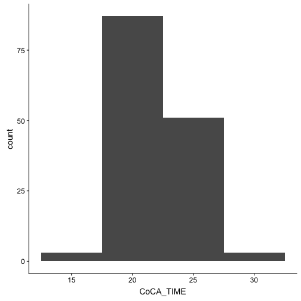<!-- -->

## Shape Trail Test

### Completion Time (sec)

<table class="table" style="margin-left: auto; margin-right: auto;">
 <thead>
  <tr>
   <th style="text-align:left;">   </th>
   <th style="text-align:right;"> vars </th>
   <th style="text-align:right;"> n </th>
   <th style="text-align:right;"> mean </th>
   <th style="text-align:right;"> sd </th>
   <th style="text-align:right;"> median </th>
   <th style="text-align:right;"> trimmed </th>
   <th style="text-align:right;"> mad </th>
   <th style="text-align:right;"> min </th>
   <th style="text-align:right;"> max </th>
   <th style="text-align:right;"> range </th>
   <th style="text-align:right;"> skew </th>
   <th style="text-align:right;"> kurtosis </th>
   <th style="text-align:right;"> se </th>
  </tr>
 </thead>
<tbody>
  <tr>
   <td style="text-align:left;"> X1 </td>
   <td style="text-align:right;"> 1 </td>
   <td style="text-align:right;"> 151 </td>
   <td style="text-align:right;"> 17.17 </td>
   <td style="text-align:right;"> 8.71 </td>
   <td style="text-align:right;"> 15 </td>
   <td style="text-align:right;"> 15.76 </td>
   <td style="text-align:right;"> 5.93 </td>
   <td style="text-align:right;"> 6 </td>
   <td style="text-align:right;"> 56 </td>
   <td style="text-align:right;"> 50 </td>
   <td style="text-align:right;"> 1.94 </td>
   <td style="text-align:right;"> 4.84 </td>
   <td style="text-align:right;"> 0.71 </td>
  </tr>
</tbody>
</table>

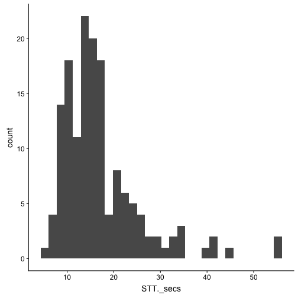<!-- -->

### Correct Lines

<table class="table" style="margin-left: auto; margin-right: auto;">
 <thead>
  <tr>
   <th style="text-align:left;">   </th>
   <th style="text-align:right;"> vars </th>
   <th style="text-align:right;"> n </th>
   <th style="text-align:right;"> mean </th>
   <th style="text-align:right;"> sd </th>
   <th style="text-align:right;"> median </th>
   <th style="text-align:right;"> trimmed </th>
   <th style="text-align:right;"> mad </th>
   <th style="text-align:right;"> min </th>
   <th style="text-align:right;"> max </th>
   <th style="text-align:right;"> range </th>
   <th style="text-align:right;"> skew </th>
   <th style="text-align:right;"> kurtosis </th>
   <th style="text-align:right;"> se </th>
  </tr>
 </thead>
<tbody>
  <tr>
   <td style="text-align:left;"> X1 </td>
   <td style="text-align:right;"> 1 </td>
   <td style="text-align:right;"> 151 </td>
   <td style="text-align:right;"> 6.84 </td>
   <td style="text-align:right;"> 0.54 </td>
   <td style="text-align:right;"> 7 </td>
   <td style="text-align:right;"> 7 </td>
   <td style="text-align:right;"> 0 </td>
   <td style="text-align:right;"> 4 </td>
   <td style="text-align:right;"> 7 </td>
   <td style="text-align:right;"> 3 </td>
   <td style="text-align:right;"> -3.58 </td>
   <td style="text-align:right;"> 12.44 </td>
   <td style="text-align:right;"> 0.04 </td>
  </tr>
</tbody>
</table>

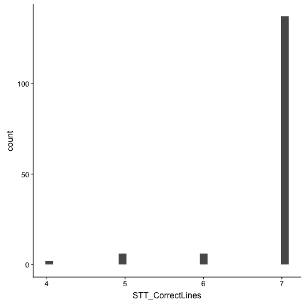<!-- -->

### Total Score (Seconds per Correct Line)

<table class="table" style="margin-left: auto; margin-right: auto;">
 <thead>
  <tr>
   <th style="text-align:left;">   </th>
   <th style="text-align:right;"> vars </th>
   <th style="text-align:right;"> n </th>
   <th style="text-align:right;"> mean </th>
   <th style="text-align:right;"> sd </th>
   <th style="text-align:right;"> median </th>
   <th style="text-align:right;"> trimmed </th>
   <th style="text-align:right;"> mad </th>
   <th style="text-align:right;"> min </th>
   <th style="text-align:right;"> max </th>
   <th style="text-align:right;"> range </th>
   <th style="text-align:right;"> skew </th>
   <th style="text-align:right;"> kurtosis </th>
   <th style="text-align:right;"> se </th>
  </tr>
 </thead>
<tbody>
  <tr>
   <td style="text-align:left;"> X1 </td>
   <td style="text-align:right;"> 1 </td>
   <td style="text-align:right;"> 151 </td>
   <td style="text-align:right;"> 2.56 </td>
   <td style="text-align:right;"> 1.55 </td>
   <td style="text-align:right;"> 2.14 </td>
   <td style="text-align:right;"> 2.31 </td>
   <td style="text-align:right;"> 0.85 </td>
   <td style="text-align:right;"> 1 </td>
   <td style="text-align:right;"> 14 </td>
   <td style="text-align:right;"> 13 </td>
   <td style="text-align:right;"> 3.42 </td>
   <td style="text-align:right;"> 19.18 </td>
   <td style="text-align:right;"> 0.13 </td>
  </tr>
</tbody>
</table>

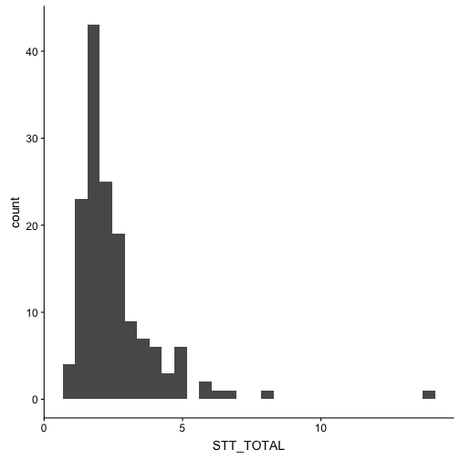<!-- -->

## Verbal List Learning

### Total Score across Three Learning Trials

<table class="table" style="margin-left: auto; margin-right: auto;">
 <thead>
  <tr>
   <th style="text-align:left;">   </th>
   <th style="text-align:right;"> vars </th>
   <th style="text-align:right;"> n </th>
   <th style="text-align:right;"> mean </th>
   <th style="text-align:right;"> sd </th>
   <th style="text-align:right;"> median </th>
   <th style="text-align:right;"> trimmed </th>
   <th style="text-align:right;"> mad </th>
   <th style="text-align:right;"> min </th>
   <th style="text-align:right;"> max </th>
   <th style="text-align:right;"> range </th>
   <th style="text-align:right;"> skew </th>
   <th style="text-align:right;"> kurtosis </th>
   <th style="text-align:right;"> se </th>
  </tr>
 </thead>
<tbody>
  <tr>
   <td style="text-align:left;"> X1 </td>
   <td style="text-align:right;"> 1 </td>
   <td style="text-align:right;"> 151 </td>
   <td style="text-align:right;"> 18.38 </td>
   <td style="text-align:right;"> 1.91 </td>
   <td style="text-align:right;"> 19 </td>
   <td style="text-align:right;"> 18.59 </td>
   <td style="text-align:right;"> 1.48 </td>
   <td style="text-align:right;"> 12 </td>
   <td style="text-align:right;"> 21 </td>
   <td style="text-align:right;"> 9 </td>
   <td style="text-align:right;"> -0.94 </td>
   <td style="text-align:right;"> 0.57 </td>
   <td style="text-align:right;"> 0.16 </td>
  </tr>
</tbody>
</table>

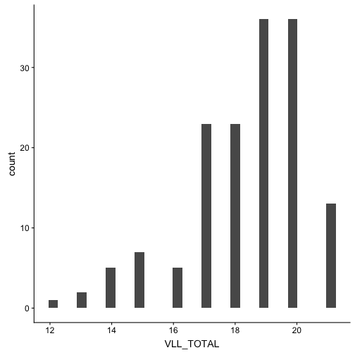<!-- -->

### Delayed Free Recall

<table class="table" style="margin-left: auto; margin-right: auto;">
 <thead>
  <tr>
   <th style="text-align:left;">   </th>
   <th style="text-align:right;"> vars </th>
   <th style="text-align:right;"> n </th>
   <th style="text-align:right;"> mean </th>
   <th style="text-align:right;"> sd </th>
   <th style="text-align:right;"> median </th>
   <th style="text-align:right;"> trimmed </th>
   <th style="text-align:right;"> mad </th>
   <th style="text-align:right;"> min </th>
   <th style="text-align:right;"> max </th>
   <th style="text-align:right;"> range </th>
   <th style="text-align:right;"> skew </th>
   <th style="text-align:right;"> kurtosis </th>
   <th style="text-align:right;"> se </th>
  </tr>
 </thead>
<tbody>
  <tr>
   <td style="text-align:left;"> X1 </td>
   <td style="text-align:right;"> 1 </td>
   <td style="text-align:right;"> 151 </td>
   <td style="text-align:right;"> 3.77 </td>
   <td style="text-align:right;"> 2 </td>
   <td style="text-align:right;"> 4 </td>
   <td style="text-align:right;"> 3.83 </td>
   <td style="text-align:right;"> 1.48 </td>
   <td style="text-align:right;"> 0 </td>
   <td style="text-align:right;"> 7 </td>
   <td style="text-align:right;"> 7 </td>
   <td style="text-align:right;"> -0.23 </td>
   <td style="text-align:right;"> -0.77 </td>
   <td style="text-align:right;"> 0.16 </td>
  </tr>
</tbody>
</table>

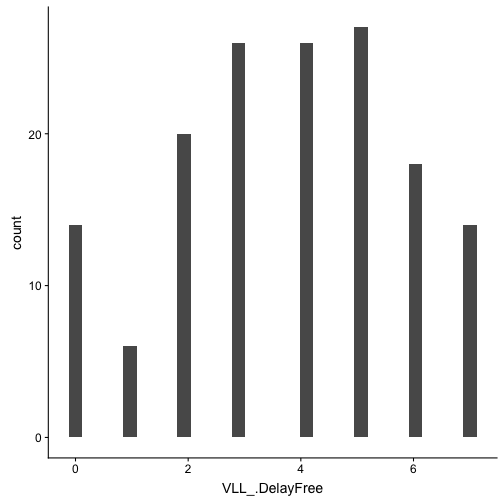<!-- -->

### Yes/No Recognition

<table class="table" style="margin-left: auto; margin-right: auto;">
 <thead>
  <tr>
   <th style="text-align:left;">   </th>
   <th style="text-align:right;"> vars </th>
   <th style="text-align:right;"> n </th>
   <th style="text-align:right;"> mean </th>
   <th style="text-align:right;"> sd </th>
   <th style="text-align:right;"> median </th>
   <th style="text-align:right;"> trimmed </th>
   <th style="text-align:right;"> mad </th>
   <th style="text-align:right;"> min </th>
   <th style="text-align:right;"> max </th>
   <th style="text-align:right;"> range </th>
   <th style="text-align:right;"> skew </th>
   <th style="text-align:right;"> kurtosis </th>
   <th style="text-align:right;"> se </th>
  </tr>
 </thead>
<tbody>
  <tr>
   <td style="text-align:left;"> X1 </td>
   <td style="text-align:right;"> 1 </td>
   <td style="text-align:right;"> 151 </td>
   <td style="text-align:right;"> 12.56 </td>
   <td style="text-align:right;"> 1.69 </td>
   <td style="text-align:right;"> 13 </td>
   <td style="text-align:right;"> 12.86 </td>
   <td style="text-align:right;"> 1.48 </td>
   <td style="text-align:right;"> 7 </td>
   <td style="text-align:right;"> 14 </td>
   <td style="text-align:right;"> 7 </td>
   <td style="text-align:right;"> -1.48 </td>
   <td style="text-align:right;"> 1.85 </td>
   <td style="text-align:right;"> 0.14 </td>
  </tr>
</tbody>
</table>

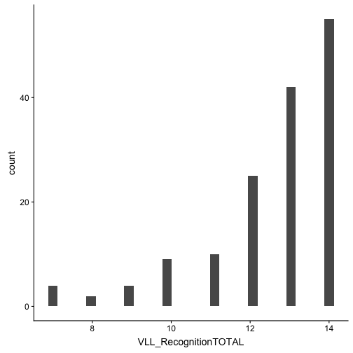<!-- -->

### Forced Choice Recognition

<table class="table" style="margin-left: auto; margin-right: auto;">
 <thead>
  <tr>
   <th style="text-align:left;">   </th>
   <th style="text-align:right;"> vars </th>
   <th style="text-align:right;"> n </th>
   <th style="text-align:right;"> mean </th>
   <th style="text-align:right;"> sd </th>
   <th style="text-align:right;"> median </th>
   <th style="text-align:right;"> trimmed </th>
   <th style="text-align:right;"> mad </th>
   <th style="text-align:right;"> min </th>
   <th style="text-align:right;"> max </th>
   <th style="text-align:right;"> range </th>
   <th style="text-align:right;"> skew </th>
   <th style="text-align:right;"> kurtosis </th>
   <th style="text-align:right;"> se </th>
  </tr>
 </thead>
<tbody>
  <tr>
   <td style="text-align:left;"> X1 </td>
   <td style="text-align:right;"> 1 </td>
   <td style="text-align:right;"> 151 </td>
   <td style="text-align:right;"> 6.91 </td>
   <td style="text-align:right;"> 0.35 </td>
   <td style="text-align:right;"> 7 </td>
   <td style="text-align:right;"> 7 </td>
   <td style="text-align:right;"> 0 </td>
   <td style="text-align:right;"> 4 </td>
   <td style="text-align:right;"> 7 </td>
   <td style="text-align:right;"> 3 </td>
   <td style="text-align:right;"> -5.2 </td>
   <td style="text-align:right;"> 33.85 </td>
   <td style="text-align:right;"> 0.03 </td>
  </tr>
</tbody>
</table>

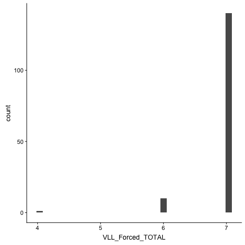<!-- -->

## Complex Figure

### Figure Copy

<table class="table" style="margin-left: auto; margin-right: auto;">
 <thead>
  <tr>
   <th style="text-align:left;">   </th>
   <th style="text-align:right;"> vars </th>
   <th style="text-align:right;"> n </th>
   <th style="text-align:right;"> mean </th>
   <th style="text-align:right;"> sd </th>
   <th style="text-align:right;"> median </th>
   <th style="text-align:right;"> trimmed </th>
   <th style="text-align:right;"> mad </th>
   <th style="text-align:right;"> min </th>
   <th style="text-align:right;"> max </th>
   <th style="text-align:right;"> range </th>
   <th style="text-align:right;"> skew </th>
   <th style="text-align:right;"> kurtosis </th>
   <th style="text-align:right;"> se </th>
  </tr>
 </thead>
<tbody>
  <tr>
   <td style="text-align:left;"> X1 </td>
   <td style="text-align:right;"> 1 </td>
   <td style="text-align:right;"> 151 </td>
   <td style="text-align:right;"> 15.99 </td>
   <td style="text-align:right;"> 2.13 </td>
   <td style="text-align:right;"> 16.5 </td>
   <td style="text-align:right;"> 16.32 </td>
   <td style="text-align:right;"> 1.48 </td>
   <td style="text-align:right;"> 0 </td>
   <td style="text-align:right;"> 18 </td>
   <td style="text-align:right;"> 18 </td>
   <td style="text-align:right;"> -3.37 </td>
   <td style="text-align:right;"> 19.81 </td>
   <td style="text-align:right;"> 0.17 </td>
  </tr>
</tbody>
</table>

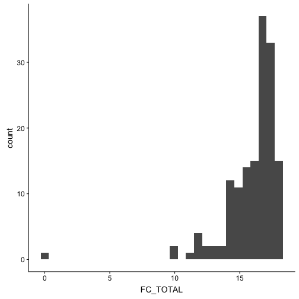<!-- -->

### Figure Recall

<table class="table" style="margin-left: auto; margin-right: auto;">
 <thead>
  <tr>
   <th style="text-align:left;">   </th>
   <th style="text-align:right;"> vars </th>
   <th style="text-align:right;"> n </th>
   <th style="text-align:right;"> mean </th>
   <th style="text-align:right;"> sd </th>
   <th style="text-align:right;"> median </th>
   <th style="text-align:right;"> trimmed </th>
   <th style="text-align:right;"> mad </th>
   <th style="text-align:right;"> min </th>
   <th style="text-align:right;"> max </th>
   <th style="text-align:right;"> range </th>
   <th style="text-align:right;"> skew </th>
   <th style="text-align:right;"> kurtosis </th>
   <th style="text-align:right;"> se </th>
  </tr>
 </thead>
<tbody>
  <tr>
   <td style="text-align:left;"> X1 </td>
   <td style="text-align:right;"> 1 </td>
   <td style="text-align:right;"> 151 </td>
   <td style="text-align:right;"> 12.4 </td>
   <td style="text-align:right;"> 3.28 </td>
   <td style="text-align:right;"> 13 </td>
   <td style="text-align:right;"> 12.61 </td>
   <td style="text-align:right;"> 2.97 </td>
   <td style="text-align:right;"> 0 </td>
   <td style="text-align:right;"> 18 </td>
   <td style="text-align:right;"> 18 </td>
   <td style="text-align:right;"> -0.85 </td>
   <td style="text-align:right;"> 1.32 </td>
   <td style="text-align:right;"> 0.27 </td>
  </tr>
</tbody>
</table>

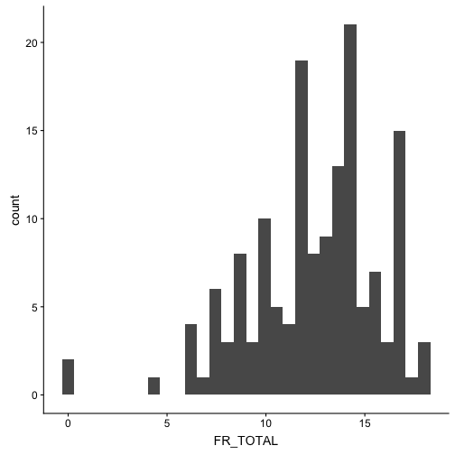<!-- -->

## Animal Fluency

<table class="table" style="margin-left: auto; margin-right: auto;">
 <thead>
  <tr>
   <th style="text-align:left;">   </th>
   <th style="text-align:right;"> vars </th>
   <th style="text-align:right;"> n </th>
   <th style="text-align:right;"> mean </th>
   <th style="text-align:right;"> sd </th>
   <th style="text-align:right;"> median </th>
   <th style="text-align:right;"> trimmed </th>
   <th style="text-align:right;"> mad </th>
   <th style="text-align:right;"> min </th>
   <th style="text-align:right;"> max </th>
   <th style="text-align:right;"> range </th>
   <th style="text-align:right;"> skew </th>
   <th style="text-align:right;"> kurtosis </th>
   <th style="text-align:right;"> se </th>
  </tr>
 </thead>
<tbody>
  <tr>
   <td style="text-align:left;"> X1 </td>
   <td style="text-align:right;"> 1 </td>
   <td style="text-align:right;"> 151 </td>
   <td style="text-align:right;"> 21.07 </td>
   <td style="text-align:right;"> 6.19 </td>
   <td style="text-align:right;"> 21 </td>
   <td style="text-align:right;"> 20.89 </td>
   <td style="text-align:right;"> 5.93 </td>
   <td style="text-align:right;"> 1 </td>
   <td style="text-align:right;"> 42 </td>
   <td style="text-align:right;"> 41 </td>
   <td style="text-align:right;"> 0.34 </td>
   <td style="text-align:right;"> 0.96 </td>
   <td style="text-align:right;"> 0.5 </td>
  </tr>
</tbody>
</table>

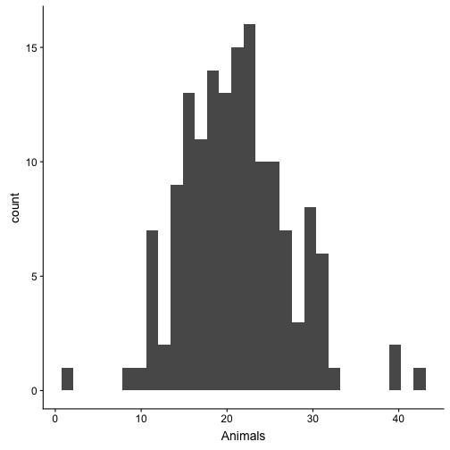<!-- -->

## Lexical Fluency

<table class="table" style="margin-left: auto; margin-right: auto;">
 <thead>
  <tr>
   <th style="text-align:left;">   </th>
   <th style="text-align:right;"> vars </th>
   <th style="text-align:right;"> n </th>
   <th style="text-align:right;"> mean </th>
   <th style="text-align:right;"> sd </th>
   <th style="text-align:right;"> median </th>
   <th style="text-align:right;"> trimmed </th>
   <th style="text-align:right;"> mad </th>
   <th style="text-align:right;"> min </th>
   <th style="text-align:right;"> max </th>
   <th style="text-align:right;"> range </th>
   <th style="text-align:right;"> skew </th>
   <th style="text-align:right;"> kurtosis </th>
   <th style="text-align:right;"> se </th>
  </tr>
 </thead>
<tbody>
  <tr>
   <td style="text-align:left;"> X1 </td>
   <td style="text-align:right;"> 1 </td>
   <td style="text-align:right;"> 151 </td>
   <td style="text-align:right;"> 14.38 </td>
   <td style="text-align:right;"> 4.99 </td>
   <td style="text-align:right;"> 14 </td>
   <td style="text-align:right;"> 14.29 </td>
   <td style="text-align:right;"> 4.45 </td>
   <td style="text-align:right;"> 1 </td>
   <td style="text-align:right;"> 27 </td>
   <td style="text-align:right;"> 26 </td>
   <td style="text-align:right;"> 0.09 </td>
   <td style="text-align:right;"> -0.22 </td>
   <td style="text-align:right;"> 0.41 </td>
  </tr>
</tbody>
</table>

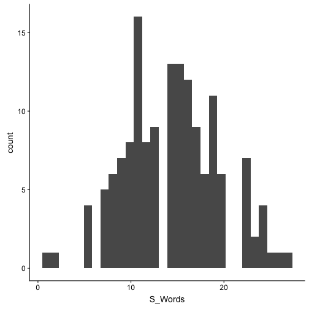<!-- -->

## Working Memory

### Trial 1

<table class="table" style="margin-left: auto; margin-right: auto;">
 <thead>
  <tr>
   <th style="text-align:left;">   </th>
   <th style="text-align:right;"> vars </th>
   <th style="text-align:right;"> n </th>
   <th style="text-align:right;"> mean </th>
   <th style="text-align:right;"> sd </th>
   <th style="text-align:right;"> median </th>
   <th style="text-align:right;"> trimmed </th>
   <th style="text-align:right;"> mad </th>
   <th style="text-align:right;"> min </th>
   <th style="text-align:right;"> max </th>
   <th style="text-align:right;"> range </th>
   <th style="text-align:right;"> skew </th>
   <th style="text-align:right;"> kurtosis </th>
   <th style="text-align:right;"> se </th>
  </tr>
 </thead>
<tbody>
  <tr>
   <td style="text-align:left;"> X1 </td>
   <td style="text-align:right;"> 1 </td>
   <td style="text-align:right;"> 151 </td>
   <td style="text-align:right;"> 2.63 </td>
   <td style="text-align:right;"> 0.64 </td>
   <td style="text-align:right;"> 3 </td>
   <td style="text-align:right;"> 2.76 </td>
   <td style="text-align:right;"> 0 </td>
   <td style="text-align:right;"> 0 </td>
   <td style="text-align:right;"> 3 </td>
   <td style="text-align:right;"> 3 </td>
   <td style="text-align:right;"> -1.65 </td>
   <td style="text-align:right;"> 2.01 </td>
   <td style="text-align:right;"> 0.05 </td>
  </tr>
</tbody>
</table>

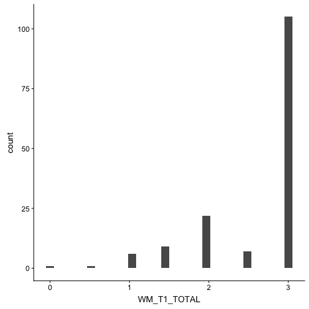<!-- -->

### Trial 2

<table class="table" style="margin-left: auto; margin-right: auto;">
 <thead>
  <tr>
   <th style="text-align:left;">   </th>
   <th style="text-align:right;"> vars </th>
   <th style="text-align:right;"> n </th>
   <th style="text-align:right;"> mean </th>
   <th style="text-align:right;"> sd </th>
   <th style="text-align:right;"> median </th>
   <th style="text-align:right;"> trimmed </th>
   <th style="text-align:right;"> mad </th>
   <th style="text-align:right;"> min </th>
   <th style="text-align:right;"> max </th>
   <th style="text-align:right;"> range </th>
   <th style="text-align:right;"> skew </th>
   <th style="text-align:right;"> kurtosis </th>
   <th style="text-align:right;"> se </th>
  </tr>
 </thead>
<tbody>
  <tr>
   <td style="text-align:left;"> X1 </td>
   <td style="text-align:right;"> 1 </td>
   <td style="text-align:right;"> 151 </td>
   <td style="text-align:right;"> 3.41 </td>
   <td style="text-align:right;"> 1.28 </td>
   <td style="text-align:right;"> 3.5 </td>
   <td style="text-align:right;"> 3.49 </td>
   <td style="text-align:right;"> 1.48 </td>
   <td style="text-align:right;"> 0 </td>
   <td style="text-align:right;"> 5 </td>
   <td style="text-align:right;"> 5 </td>
   <td style="text-align:right;"> -0.28 </td>
   <td style="text-align:right;"> -0.8 </td>
   <td style="text-align:right;"> 0.1 </td>
  </tr>
</tbody>
</table>

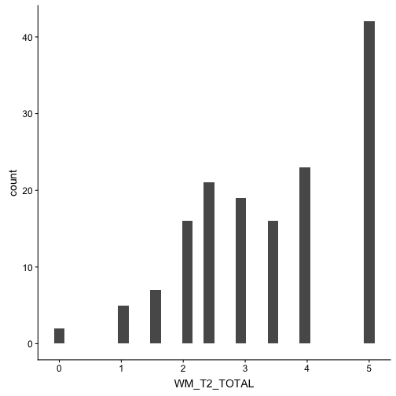<!-- -->

### Trials 1 + 2

<table class="table" style="margin-left: auto; margin-right: auto;">
 <thead>
  <tr>
   <th style="text-align:left;">   </th>
   <th style="text-align:right;"> vars </th>
   <th style="text-align:right;"> n </th>
   <th style="text-align:right;"> mean </th>
   <th style="text-align:right;"> sd </th>
   <th style="text-align:right;"> median </th>
   <th style="text-align:right;"> trimmed </th>
   <th style="text-align:right;"> mad </th>
   <th style="text-align:right;"> min </th>
   <th style="text-align:right;"> max </th>
   <th style="text-align:right;"> range </th>
   <th style="text-align:right;"> skew </th>
   <th style="text-align:right;"> kurtosis </th>
   <th style="text-align:right;"> se </th>
  </tr>
 </thead>
<tbody>
  <tr>
   <td style="text-align:left;"> X1 </td>
   <td style="text-align:right;"> 1 </td>
   <td style="text-align:right;"> 151 </td>
   <td style="text-align:right;"> 6.04 </td>
   <td style="text-align:right;"> 1.65 </td>
   <td style="text-align:right;"> 6 </td>
   <td style="text-align:right;"> 6.2 </td>
   <td style="text-align:right;"> 1.48 </td>
   <td style="text-align:right;"> 0 </td>
   <td style="text-align:right;"> 8 </td>
   <td style="text-align:right;"> 8 </td>
   <td style="text-align:right;"> -0.75 </td>
   <td style="text-align:right;"> 0.4 </td>
   <td style="text-align:right;"> 0.13 </td>
  </tr>
</tbody>
</table>

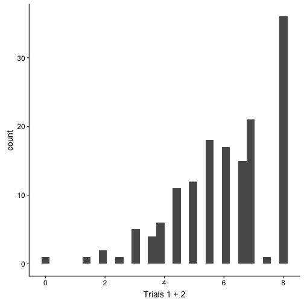<!-- -->

## Test of Focused Attention

<table class="table" style="margin-left: auto; margin-right: auto;">
 <thead>
  <tr>
   <th style="text-align:left;">   </th>
   <th style="text-align:right;"> vars </th>
   <th style="text-align:right;"> n </th>
   <th style="text-align:right;"> mean </th>
   <th style="text-align:right;"> sd </th>
   <th style="text-align:right;"> median </th>
   <th style="text-align:right;"> trimmed </th>
   <th style="text-align:right;"> mad </th>
   <th style="text-align:right;"> min </th>
   <th style="text-align:right;"> max </th>
   <th style="text-align:right;"> range </th>
   <th style="text-align:right;"> skew </th>
   <th style="text-align:right;"> kurtosis </th>
   <th style="text-align:right;"> se </th>
  </tr>
 </thead>
<tbody>
  <tr>
   <td style="text-align:left;"> X1 </td>
   <td style="text-align:right;"> 1 </td>
   <td style="text-align:right;"> 151 </td>
   <td style="text-align:right;"> 40.35 </td>
   <td style="text-align:right;"> 2.49 </td>
   <td style="text-align:right;"> 41 </td>
   <td style="text-align:right;"> 40.89 </td>
   <td style="text-align:right;"> 1.48 </td>
   <td style="text-align:right;"> 26 </td>
   <td style="text-align:right;"> 42 </td>
   <td style="text-align:right;"> 16 </td>
   <td style="text-align:right;"> -2.79 </td>
   <td style="text-align:right;"> 9.84 </td>
   <td style="text-align:right;"> 0.2 </td>
  </tr>
</tbody>
</table>

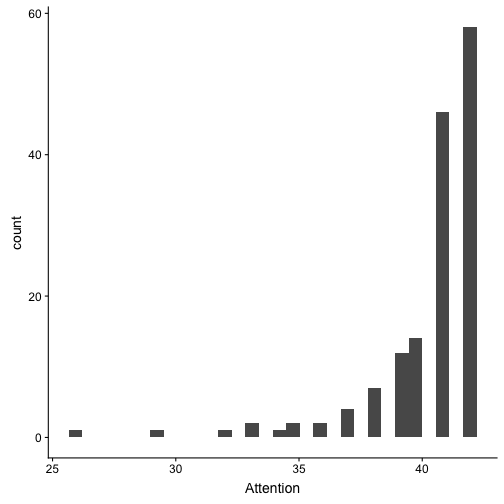<!-- -->

## Clock Drawing

### Command

<table class="table" style="margin-left: auto; margin-right: auto;">
 <thead>
  <tr>
   <th style="text-align:left;">   </th>
   <th style="text-align:right;"> vars </th>
   <th style="text-align:right;"> n </th>
   <th style="text-align:right;"> mean </th>
   <th style="text-align:right;"> sd </th>
   <th style="text-align:right;"> median </th>
   <th style="text-align:right;"> trimmed </th>
   <th style="text-align:right;"> mad </th>
   <th style="text-align:right;"> min </th>
   <th style="text-align:right;"> max </th>
   <th style="text-align:right;"> range </th>
   <th style="text-align:right;"> skew </th>
   <th style="text-align:right;"> kurtosis </th>
   <th style="text-align:right;"> se </th>
  </tr>
 </thead>
<tbody>
  <tr>
   <td style="text-align:left;"> X1 </td>
   <td style="text-align:right;"> 1 </td>
   <td style="text-align:right;"> 150 </td>
   <td style="text-align:right;"> 9.26 </td>
   <td style="text-align:right;"> 1.11 </td>
   <td style="text-align:right;"> 10 </td>
   <td style="text-align:right;"> 9.48 </td>
   <td style="text-align:right;"> 0 </td>
   <td style="text-align:right;"> 3 </td>
   <td style="text-align:right;"> 10 </td>
   <td style="text-align:right;"> 7 </td>
   <td style="text-align:right;"> -2.26 </td>
   <td style="text-align:right;"> 7.02 </td>
   <td style="text-align:right;"> 0.09 </td>
  </tr>
</tbody>
</table>

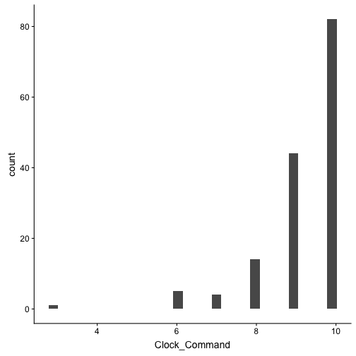<!-- -->

### Copy

<table class="table" style="margin-left: auto; margin-right: auto;">
 <thead>
  <tr>
   <th style="text-align:left;">   </th>
   <th style="text-align:right;"> vars </th>
   <th style="text-align:right;"> n </th>
   <th style="text-align:right;"> mean </th>
   <th style="text-align:right;"> sd </th>
   <th style="text-align:right;"> median </th>
   <th style="text-align:right;"> trimmed </th>
   <th style="text-align:right;"> mad </th>
   <th style="text-align:right;"> min </th>
   <th style="text-align:right;"> max </th>
   <th style="text-align:right;"> range </th>
   <th style="text-align:right;"> skew </th>
   <th style="text-align:right;"> kurtosis </th>
   <th style="text-align:right;"> se </th>
  </tr>
 </thead>
<tbody>
  <tr>
   <td style="text-align:left;"> X1 </td>
   <td style="text-align:right;"> 1 </td>
   <td style="text-align:right;"> 150 </td>
   <td style="text-align:right;"> 9.76 </td>
   <td style="text-align:right;"> 0.53 </td>
   <td style="text-align:right;"> 10 </td>
   <td style="text-align:right;"> 9.86 </td>
   <td style="text-align:right;"> 0 </td>
   <td style="text-align:right;"> 6 </td>
   <td style="text-align:right;"> 10 </td>
   <td style="text-align:right;"> 4 </td>
   <td style="text-align:right;"> -3.2 </td>
   <td style="text-align:right;"> 16.02 </td>
   <td style="text-align:right;"> 0.04 </td>
  </tr>
</tbody>
</table>

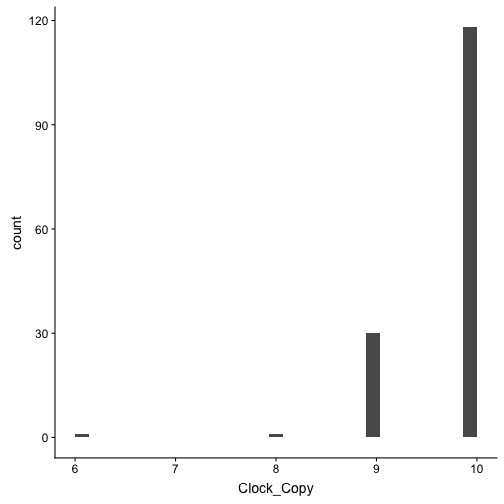<!-- -->

## Number Symbol Matching Test

### Written

<table class="table" style="margin-left: auto; margin-right: auto;">
 <thead>
  <tr>
   <th style="text-align:left;">   </th>
   <th style="text-align:right;"> vars </th>
   <th style="text-align:right;"> n </th>
   <th style="text-align:right;"> mean </th>
   <th style="text-align:right;"> sd </th>
   <th style="text-align:right;"> median </th>
   <th style="text-align:right;"> trimmed </th>
   <th style="text-align:right;"> mad </th>
   <th style="text-align:right;"> min </th>
   <th style="text-align:right;"> max </th>
   <th style="text-align:right;"> range </th>
   <th style="text-align:right;"> skew </th>
   <th style="text-align:right;"> kurtosis </th>
   <th style="text-align:right;"> se </th>
  </tr>
 </thead>
<tbody>
  <tr>
   <td style="text-align:left;"> X1 </td>
   <td style="text-align:right;"> 1 </td>
   <td style="text-align:right;"> 149 </td>
   <td style="text-align:right;"> 15.43 </td>
   <td style="text-align:right;"> 3.45 </td>
   <td style="text-align:right;"> 16 </td>
   <td style="text-align:right;"> 15.46 </td>
   <td style="text-align:right;"> 2.97 </td>
   <td style="text-align:right;"> 1 </td>
   <td style="text-align:right;"> 25 </td>
   <td style="text-align:right;"> 24 </td>
   <td style="text-align:right;"> -0.28 </td>
   <td style="text-align:right;"> 1.4 </td>
   <td style="text-align:right;"> 0.28 </td>
  </tr>
</tbody>
</table>

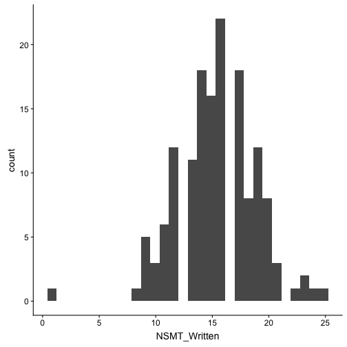<!-- -->

## Number Symbol Matching Test

### Oral

<table class="table" style="margin-left: auto; margin-right: auto;">
 <thead>
  <tr>
   <th style="text-align:left;">   </th>
   <th style="text-align:right;"> vars </th>
   <th style="text-align:right;"> n </th>
   <th style="text-align:right;"> mean </th>
   <th style="text-align:right;"> sd </th>
   <th style="text-align:right;"> median </th>
   <th style="text-align:right;"> trimmed </th>
   <th style="text-align:right;"> mad </th>
   <th style="text-align:right;"> min </th>
   <th style="text-align:right;"> max </th>
   <th style="text-align:right;"> range </th>
   <th style="text-align:right;"> skew </th>
   <th style="text-align:right;"> kurtosis </th>
   <th style="text-align:right;"> se </th>
  </tr>
 </thead>
<tbody>
  <tr>
   <td style="text-align:left;"> X1 </td>
   <td style="text-align:right;"> 1 </td>
   <td style="text-align:right;"> 148 </td>
   <td style="text-align:right;"> 17.73 </td>
   <td style="text-align:right;"> 3.59 </td>
   <td style="text-align:right;"> 18 </td>
   <td style="text-align:right;"> 17.78 </td>
   <td style="text-align:right;"> 2.97 </td>
   <td style="text-align:right;"> 8 </td>
   <td style="text-align:right;"> 27 </td>
   <td style="text-align:right;"> 19 </td>
   <td style="text-align:right;"> -0.14 </td>
   <td style="text-align:right;"> 0.08 </td>
   <td style="text-align:right;"> 0.29 </td>
  </tr>
</tbody>
</table>

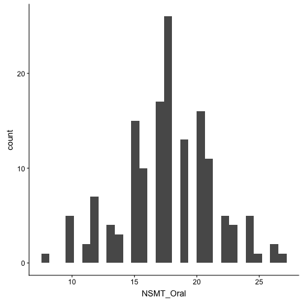<!-- -->

## Verbal Naming Test

<table class="table" style="margin-left: auto; margin-right: auto;">
 <thead>
  <tr>
   <th style="text-align:left;">   </th>
   <th style="text-align:right;"> vars </th>
   <th style="text-align:right;"> n </th>
   <th style="text-align:right;"> mean </th>
   <th style="text-align:right;"> sd </th>
   <th style="text-align:right;"> median </th>
   <th style="text-align:right;"> trimmed </th>
   <th style="text-align:right;"> mad </th>
   <th style="text-align:right;"> min </th>
   <th style="text-align:right;"> max </th>
   <th style="text-align:right;"> range </th>
   <th style="text-align:right;"> skew </th>
   <th style="text-align:right;"> kurtosis </th>
   <th style="text-align:right;"> se </th>
  </tr>
 </thead>
<tbody>
  <tr>
   <td style="text-align:left;"> X1 </td>
   <td style="text-align:right;"> 1 </td>
   <td style="text-align:right;"> 151 </td>
   <td style="text-align:right;"> 13.95 </td>
   <td style="text-align:right;"> 1.17 </td>
   <td style="text-align:right;"> 14 </td>
   <td style="text-align:right;"> 14.15 </td>
   <td style="text-align:right;"> 1.48 </td>
   <td style="text-align:right;"> 10 </td>
   <td style="text-align:right;"> 15 </td>
   <td style="text-align:right;"> 5 </td>
   <td style="text-align:right;"> -1.51 </td>
   <td style="text-align:right;"> 2.52 </td>
   <td style="text-align:right;"> 0.1 </td>
  </tr>
</tbody>
</table>

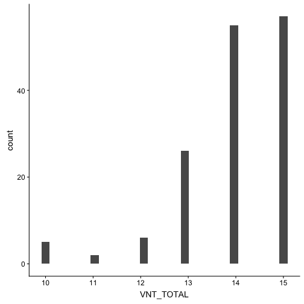<!-- -->

## Orientation

<table class="table" style="margin-left: auto; margin-right: auto;">
 <thead>
  <tr>
   <th style="text-align:left;">   </th>
   <th style="text-align:right;"> vars </th>
   <th style="text-align:right;"> n </th>
   <th style="text-align:right;"> mean </th>
   <th style="text-align:right;"> sd </th>
   <th style="text-align:right;"> median </th>
   <th style="text-align:right;"> trimmed </th>
   <th style="text-align:right;"> mad </th>
   <th style="text-align:right;"> min </th>
   <th style="text-align:right;"> max </th>
   <th style="text-align:right;"> range </th>
   <th style="text-align:right;"> skew </th>
   <th style="text-align:right;"> kurtosis </th>
   <th style="text-align:right;"> se </th>
  </tr>
 </thead>
<tbody>
  <tr>
   <td style="text-align:left;"> X1 </td>
   <td style="text-align:right;"> 1 </td>
   <td style="text-align:right;"> 151 </td>
   <td style="text-align:right;"> 7.86 </td>
   <td style="text-align:right;"> 0.37 </td>
   <td style="text-align:right;"> 8 </td>
   <td style="text-align:right;"> 7.96 </td>
   <td style="text-align:right;"> 0 </td>
   <td style="text-align:right;"> 6 </td>
   <td style="text-align:right;"> 8 </td>
   <td style="text-align:right;"> 2 </td>
   <td style="text-align:right;"> -2.46 </td>
   <td style="text-align:right;"> 5.31 </td>
   <td style="text-align:right;"> 0.03 </td>
  </tr>
</tbody>
</table>

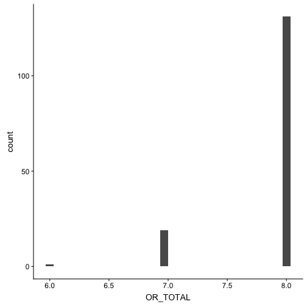<!-- -->

## Prospective Memory Test

<table class="table" style="margin-left: auto; margin-right: auto;">
 <thead>
  <tr>
   <th style="text-align:left;">   </th>
   <th style="text-align:right;"> vars </th>
   <th style="text-align:right;"> n </th>
   <th style="text-align:right;"> mean </th>
   <th style="text-align:right;"> sd </th>
   <th style="text-align:right;"> median </th>
   <th style="text-align:right;"> trimmed </th>
   <th style="text-align:right;"> mad </th>
   <th style="text-align:right;"> min </th>
   <th style="text-align:right;"> max </th>
   <th style="text-align:right;"> range </th>
   <th style="text-align:right;"> skew </th>
   <th style="text-align:right;"> kurtosis </th>
   <th style="text-align:right;"> se </th>
  </tr>
 </thead>
<tbody>
  <tr>
   <td style="text-align:left;"> X1 </td>
   <td style="text-align:right;"> 1 </td>
   <td style="text-align:right;"> 151 </td>
   <td style="text-align:right;"> 0.7 </td>
   <td style="text-align:right;"> 0.46 </td>
   <td style="text-align:right;"> 1 </td>
   <td style="text-align:right;"> 0.75 </td>
   <td style="text-align:right;"> 0 </td>
   <td style="text-align:right;"> 0 </td>
   <td style="text-align:right;"> 1 </td>
   <td style="text-align:right;"> 1 </td>
   <td style="text-align:right;"> -0.87 </td>
   <td style="text-align:right;"> -1.24 </td>
   <td style="text-align:right;"> 0.04 </td>
  </tr>
</tbody>
</table>

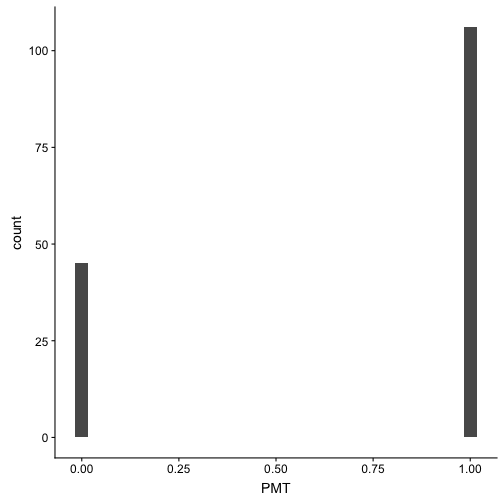<!-- -->

# Covariance Matrix

<table class="table" style="margin-left: auto; margin-right: auto;">
 <thead>
  <tr>
   <th style="text-align:left;">   </th>
   <th style="text-align:right;"> STT </th>
   <th style="text-align:right;"> VLL_ID </th>
   <th style="text-align:right;"> FC_FR </th>
   <th style="text-align:right;"> Fluency </th>
   <th style="text-align:right;"> WM </th>
   <th style="text-align:right;"> TFA </th>
   <th style="text-align:right;"> NSMT_W </th>
   <th style="text-align:right;"> VNT </th>
   <th style="text-align:right;"> Orientation </th>
   <th style="text-align:right;"> PMT </th>
   <th style="text-align:right;"> Functional </th>
  </tr>
 </thead>
<tbody>
  <tr>
   <td style="text-align:left;"> STT </td>
   <td style="text-align:right;"> 2.43 </td>
   <td style="text-align:right;"> 1.30 </td>
   <td style="text-align:right;"> 1.59 </td>
   <td style="text-align:right;"> 4.61 </td>
   <td style="text-align:right;"> 0.67 </td>
   <td style="text-align:right;"> 0.98 </td>
   <td style="text-align:right;"> 2.26 </td>
   <td style="text-align:right;"> 0.36 </td>
   <td style="text-align:right;"> 0.07 </td>
   <td style="text-align:right;"> 0.17 </td>
   <td style="text-align:right;"> 0.28 </td>
  </tr>
  <tr>
   <td style="text-align:left;"> VLL_ID </td>
   <td style="text-align:right;"> 1.30 </td>
   <td style="text-align:right;"> 10.14 </td>
   <td style="text-align:right;"> 4.20 </td>
   <td style="text-align:right;"> 9.14 </td>
   <td style="text-align:right;"> 1.95 </td>
   <td style="text-align:right;"> 2.60 </td>
   <td style="text-align:right;"> 3.08 </td>
   <td style="text-align:right;"> 0.96 </td>
   <td style="text-align:right;"> 0.16 </td>
   <td style="text-align:right;"> 0.44 </td>
   <td style="text-align:right;"> 0.59 </td>
  </tr>
  <tr>
   <td style="text-align:left;"> FC_FR </td>
   <td style="text-align:right;"> 1.59 </td>
   <td style="text-align:right;"> 4.20 </td>
   <td style="text-align:right;"> 18.47 </td>
   <td style="text-align:right;"> 12.65 </td>
   <td style="text-align:right;"> 2.35 </td>
   <td style="text-align:right;"> 2.23 </td>
   <td style="text-align:right;"> 6.48 </td>
   <td style="text-align:right;"> 1.42 </td>
   <td style="text-align:right;"> 0.29 </td>
   <td style="text-align:right;"> 0.50 </td>
   <td style="text-align:right;"> 0.67 </td>
  </tr>
  <tr>
   <td style="text-align:left;"> Fluency </td>
   <td style="text-align:right;"> 4.61 </td>
   <td style="text-align:right;"> 9.14 </td>
   <td style="text-align:right;"> 12.65 </td>
   <td style="text-align:right;"> 94.27 </td>
   <td style="text-align:right;"> 6.66 </td>
   <td style="text-align:right;"> 5.06 </td>
   <td style="text-align:right;"> 14.10 </td>
   <td style="text-align:right;"> 3.18 </td>
   <td style="text-align:right;"> 0.18 </td>
   <td style="text-align:right;"> 0.92 </td>
   <td style="text-align:right;"> 2.14 </td>
  </tr>
  <tr>
   <td style="text-align:left;"> WM </td>
   <td style="text-align:right;"> 0.67 </td>
   <td style="text-align:right;"> 1.95 </td>
   <td style="text-align:right;"> 2.35 </td>
   <td style="text-align:right;"> 6.66 </td>
   <td style="text-align:right;"> 2.69 </td>
   <td style="text-align:right;"> 1.10 </td>
   <td style="text-align:right;"> 2.25 </td>
   <td style="text-align:right;"> 0.52 </td>
   <td style="text-align:right;"> 0.10 </td>
   <td style="text-align:right;"> 0.18 </td>
   <td style="text-align:right;"> 0.38 </td>
  </tr>
  <tr>
   <td style="text-align:left;"> TFA </td>
   <td style="text-align:right;"> 0.98 </td>
   <td style="text-align:right;"> 2.60 </td>
   <td style="text-align:right;"> 2.23 </td>
   <td style="text-align:right;"> 5.06 </td>
   <td style="text-align:right;"> 1.10 </td>
   <td style="text-align:right;"> 6.33 </td>
   <td style="text-align:right;"> 1.72 </td>
   <td style="text-align:right;"> 0.44 </td>
   <td style="text-align:right;"> 0.05 </td>
   <td style="text-align:right;"> 0.37 </td>
   <td style="text-align:right;"> 0.69 </td>
  </tr>
  <tr>
   <td style="text-align:left;"> NSMT_W </td>
   <td style="text-align:right;"> 2.26 </td>
   <td style="text-align:right;"> 3.08 </td>
   <td style="text-align:right;"> 6.48 </td>
   <td style="text-align:right;"> 14.10 </td>
   <td style="text-align:right;"> 2.25 </td>
   <td style="text-align:right;"> 1.72 </td>
   <td style="text-align:right;"> 11.99 </td>
   <td style="text-align:right;"> 0.86 </td>
   <td style="text-align:right;"> 0.23 </td>
   <td style="text-align:right;"> 0.46 </td>
   <td style="text-align:right;"> 0.64 </td>
  </tr>
  <tr>
   <td style="text-align:left;"> VNT </td>
   <td style="text-align:right;"> 0.36 </td>
   <td style="text-align:right;"> 0.96 </td>
   <td style="text-align:right;"> 1.42 </td>
   <td style="text-align:right;"> 3.18 </td>
   <td style="text-align:right;"> 0.52 </td>
   <td style="text-align:right;"> 0.44 </td>
   <td style="text-align:right;"> 0.86 </td>
   <td style="text-align:right;"> 1.25 </td>
   <td style="text-align:right;"> 0.08 </td>
   <td style="text-align:right;"> 0.05 </td>
   <td style="text-align:right;"> 0.18 </td>
  </tr>
  <tr>
   <td style="text-align:left;"> Orientation </td>
   <td style="text-align:right;"> 0.07 </td>
   <td style="text-align:right;"> 0.16 </td>
   <td style="text-align:right;"> 0.29 </td>
   <td style="text-align:right;"> 0.18 </td>
   <td style="text-align:right;"> 0.10 </td>
   <td style="text-align:right;"> 0.05 </td>
   <td style="text-align:right;"> 0.23 </td>
   <td style="text-align:right;"> 0.08 </td>
   <td style="text-align:right;"> 0.14 </td>
   <td style="text-align:right;"> 0.01 </td>
   <td style="text-align:right;"> 0.02 </td>
  </tr>
  <tr>
   <td style="text-align:left;"> PMT </td>
   <td style="text-align:right;"> 0.17 </td>
   <td style="text-align:right;"> 0.44 </td>
   <td style="text-align:right;"> 0.50 </td>
   <td style="text-align:right;"> 0.92 </td>
   <td style="text-align:right;"> 0.18 </td>
   <td style="text-align:right;"> 0.37 </td>
   <td style="text-align:right;"> 0.46 </td>
   <td style="text-align:right;"> 0.05 </td>
   <td style="text-align:right;"> 0.01 </td>
   <td style="text-align:right;"> 0.21 </td>
   <td style="text-align:right;"> 0.07 </td>
  </tr>
  <tr>
   <td style="text-align:left;"> Functional </td>
   <td style="text-align:right;"> 0.28 </td>
   <td style="text-align:right;"> 0.59 </td>
   <td style="text-align:right;"> 0.67 </td>
   <td style="text-align:right;"> 2.14 </td>
   <td style="text-align:right;"> 0.38 </td>
   <td style="text-align:right;"> 0.69 </td>
   <td style="text-align:right;"> 0.64 </td>
   <td style="text-align:right;"> 0.18 </td>
   <td style="text-align:right;"> 0.02 </td>
   <td style="text-align:right;"> 0.07 </td>
   <td style="text-align:right;"> 0.55 </td>
  </tr>
</tbody>
</table>

## Corrgram

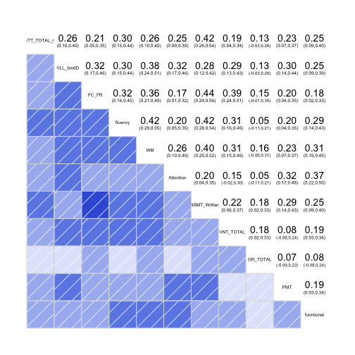<!-- -->

# Parallel Analysis/Scree Plot

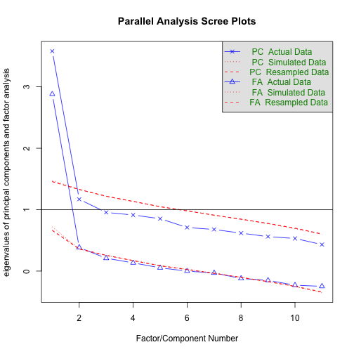<!-- -->

```
## Parallel analysis suggests that the number of factors =  1  and the number of components =  1
```

# Exploratory Factor Analysis 


```
## Factor Analysis using method =  minres
## Call: fa(r = cocaExc[c("STT_TOTAL_rc", "VLL_IandD", "FC_FR", "fluency", 
##     "WM", "Attention", "NSMT_Written", "VNT_TOTAL", "OR_TOTAL", 
##     "PMT", "functional")])
## Standardized loadings (pattern matrix) based upon correlation matrix
##               MR1    h2   u2 com
## STT_TOTAL_rc 0.50 0.248 0.75   1
## VLL_IandD    0.56 0.319 0.68   1
## FC_FR        0.55 0.307 0.69   1
## fluency      0.59 0.349 0.65   1
## WM           0.64 0.407 0.59   1
## Attention    0.44 0.197 0.80   1
## NSMT_Written 0.64 0.405 0.60   1
## VNT_TOTAL    0.46 0.209 0.79   1
## OR_TOTAL     0.22 0.051 0.95   1
## PMT          0.42 0.172 0.83   1
## functional   0.47 0.217 0.78   1
## 
##                 MR1
## SS loadings    2.88
## Proportion Var 0.26
## 
## Mean item complexity =  1
## Test of the hypothesis that 1 factor is sufficient.
## 
## The degrees of freedom for the null model are  55  and the objective function was  2.13 with Chi Square of  307.54
## The degrees of freedom for the model are 44  and the objective function was  0.33 
## 
## The root mean square of the residuals (RMSR) is  0.06 
## The df corrected root mean square of the residuals is  0.06 
## 
## The harmonic number of observations is  150 with the empirical chi square  54.49  with prob <  0.13 
## The total number of observations was  150  with Likelihood Chi Square =  47.23  with prob <  0.34 
## 
## Tucker Lewis Index of factoring reliability =  0.984
## RMSEA index =  0.027  and the 90 % confidence intervals are  0 0.061
## BIC =  -173.24
## Fit based upon off diagonal values = 0.95
## Measures of factor score adequacy             
##                                                    MR1
## Correlation of (regression) scores with factors   0.90
## Multiple R square of scores with factors          0.81
## Minimum correlation of possible factor scores     0.61
```

# Confirmatory Factor Analysis


```
## lavaan 0.6-3 ended normally after 64 iterations
## 
##   Optimization method                           NLMINB
##   Number of free parameters                         33
## 
##   Number of observations                           150
##   Number of missing patterns                         2
## 
##   Estimator                                         ML      Robust
##   Model Fit Test Statistic                      47.506      47.569
##   Degrees of freedom                                44          44
##   P-value (Chi-square)                           0.332       0.330
##   Scaling correction factor                                  0.999
##     for the Yuan-Bentler correction (Mplus variant)
## 
## Model test baseline model:
## 
##   Minimum Function Test Statistic              316.324     296.395
##   Degrees of freedom                                55          55
##   P-value                                        0.000       0.000
## 
## User model versus baseline model:
## 
##   Comparative Fit Index (CFI)                    0.987       0.985
##   Tucker-Lewis Index (TLI)                       0.983       0.982
## 
##   Robust Comparative Fit Index (CFI)                         0.986
##   Robust Tucker-Lewis Index (TLI)                            0.983
## 
## Loglikelihood and Information Criteria:
## 
##   Loglikelihood user model (H0)              -3121.439   -3121.439
##   Scaling correction factor                                  1.815
##     for the MLR correction
##   Loglikelihood unrestricted model (H1)      -3097.686   -3097.686
##   Scaling correction factor                                  1.349
##     for the MLR correction
## 
##   Number of free parameters                         33          33
##   Akaike (AIC)                                6308.878    6308.878
##   Bayesian (BIC)                              6408.229    6408.229
##   Sample-size adjusted Bayesian (BIC)         6303.790    6303.790
## 
## Root Mean Square Error of Approximation:
## 
##   RMSEA                                          0.023       0.023
##   90 Percent Confidence Interval          0.000  0.061       0.000  0.061
##   P-value RMSEA <= 0.05                          0.856       0.854
## 
##   Robust RMSEA                                               0.023
##   90 Percent Confidence Interval                             0.000  0.061
## 
## Standardized Root Mean Square Residual:
## 
##   SRMR                                           0.048       0.048
## 
## Parameter Estimates:
## 
##   Information                                 Observed
##   Observed information based on                Hessian
##   Standard Errors                   Robust.huber.white
## 
## Latent Variables:
##                    Estimate  Std.Err  z-value  P(>|z|) ci.lower ci.upper
##   Global =~                                                             
##     STT_TOTAL_rc      1.000                               1.000    1.000
##     VLL_IandD         2.312    0.579    3.990    0.000    1.176    3.448
##     FC_FR             3.560    1.022    3.483    0.000    1.557    5.563
##     fluency           7.593    1.843    4.119    0.000    3.980   11.206
##     WM                1.382    0.366    3.772    0.000    0.664    2.101
##     Attention         1.395    0.444    3.144    0.002    0.525    2.264
##     NSMT_Written      2.924    0.699    4.183    0.000    1.554    4.294
##     VNT_TOTAL         0.705    0.207    3.402    0.001    0.299    1.112
##     OR_TOTAL          0.107    0.049    2.192    0.028    0.011    0.203
##     PMT               0.242    0.070    3.441    0.001    0.104    0.380
##     functional        0.439    0.138    3.189    0.001    0.169    0.709
##    Std.lv  Std.all
##                   
##     0.765    0.495
##     1.768    0.558
##     2.723    0.561
##     5.807    0.600
##     1.057    0.642
##     1.067    0.428
##     2.236    0.645
##     0.539    0.466
##     0.082    0.224
##     0.185    0.407
##     0.336    0.457
## 
## Intercepts:
##                    Estimate  Std.Err  z-value  P(>|z|) ci.lower ci.upper
##    .STT_TOTAL_rc     -2.560    0.126  -20.298    0.000   -2.807   -2.313
##    .VLL_IandD        22.160    0.259   85.593    0.000   21.653   22.667
##    .FC_FR            28.370    0.396   71.638    0.000   27.594   29.146
##    .fluency          35.380    0.790   44.799    0.000   33.832   36.928
##    .WM                6.037    0.134   44.909    0.000    5.773    6.300
##    .Attention        40.347    0.204  198.243    0.000   39.948   40.746
##    .NSMT_Written     15.397    0.284   54.236    0.000   14.841   15.953
##    .VNT_TOTAL        13.967    0.094  147.831    0.000   13.781   14.152
##    .OR_TOTAL          7.860    0.030  263.238    0.000    7.801    7.919
##    .PMT               0.707    0.037   19.010    0.000    0.634    0.780
##    .functional        2.920    0.060   48.655    0.000    2.802    3.038
##     Global            0.000                               0.000    0.000
##    Std.lv  Std.all
##    -2.560   -1.657
##    22.160    6.989
##    28.370    5.849
##    35.380    3.658
##     6.037    3.667
##    40.347   16.186
##    15.397    4.438
##    13.967   12.070
##     7.860   21.493
##     0.707    1.552
##     2.920    3.973
##     0.000    0.000
## 
## Variances:
##                    Estimate  Std.Err  z-value  P(>|z|) ci.lower ci.upper
##    .STT_TOTAL_rc      1.800    0.710    2.535    0.011    0.409    3.192
##    .VLL_IandD         6.928    0.791    8.762    0.000    5.378    8.478
##    .FC_FR            16.112    3.772    4.271    0.000    8.718   23.506
##    .fluency          59.831   11.810    5.066    0.000   36.684   82.979
##    .WM                1.592    0.201    7.938    0.000    1.199    1.986
##    .Attention         5.075    1.416    3.584    0.000    2.300    7.850
##    .NSMT_Written      7.038    1.323    5.318    0.000    4.444    9.632
##    .VNT_TOTAL         1.048    0.206    5.099    0.000    0.645    1.451
##    .OR_TOTAL          0.127    0.028    4.468    0.000    0.071    0.183
##    .PMT               0.173    0.020    8.809    0.000    0.134    0.211
##    .functional        0.427    0.051    8.410    0.000    0.328    0.527
##     Global            0.585    0.262    2.229    0.026    0.071    1.099
##    Std.lv  Std.all
##     1.800    0.755
##     6.928    0.689
##    16.112    0.685
##    59.831    0.640
##     1.592    0.588
##     5.075    0.817
##     7.038    0.585
##     1.048    0.783
##     0.127    0.950
##     0.173    0.834
##     0.427    0.791
##     1.000    1.000
## 
## R-Square:
##                    Estimate
##     STT_TOTAL_rc      0.245
##     VLL_IandD         0.311
##     FC_FR             0.315
##     fluency           0.360
##     WM                0.412
##     Attention         0.183
##     NSMT_Written      0.415
##     VNT_TOTAL         0.217
##     OR_TOTAL          0.050
##     PMT               0.166
##     functional        0.209
```

# Structural Model with Covariates


```
## lavaan 0.6-3 ended normally after 76 iterations
## 
##   Optimization method                           NLMINB
##   Number of free parameters                         38
## 
##                                                   Used       Total
##   Number of observations                           149         150
##   Number of missing patterns                         2
## 
##   Estimator                                         ML      Robust
##   Model Fit Test Statistic                     109.420     109.721
##   Degrees of freedom                                94          94
##   P-value (Chi-square)                           0.132       0.128
##   Scaling correction factor                                  0.997
##     for the Yuan-Bentler correction (Mplus variant)
## 
## Model test baseline model:
## 
##   Minimum Function Test Statistic              449.329     434.703
##   Degrees of freedom                               110         110
##   P-value                                        0.000       0.000
## 
## User model versus baseline model:
## 
##   Comparative Fit Index (CFI)                    0.955       0.952
##   Tucker-Lewis Index (TLI)                       0.947       0.943
## 
##   Robust Comparative Fit Index (CFI)                         0.953
##   Robust Tucker-Lewis Index (TLI)                            0.945
## 
## Loglikelihood and Information Criteria:
## 
##   Loglikelihood user model (H0)              -3062.858   -3062.858
##   Scaling correction factor                                  1.719
##     for the MLR correction
##   Loglikelihood unrestricted model (H1)      -3008.148   -3008.148
##   Scaling correction factor                                  1.205
##     for the MLR correction
## 
##   Number of free parameters                         38          38
##   Akaike (AIC)                                6201.717    6201.717
##   Bayesian (BIC)                              6315.867    6315.867
##   Sample-size adjusted Bayesian (BIC)         6195.607    6195.607
## 
## Root Mean Square Error of Approximation:
## 
##   RMSEA                                          0.033       0.034
##   90 Percent Confidence Interval          0.000  0.057       0.000  0.057
##   P-value RMSEA <= 0.05                          0.863       0.858
## 
##   Robust RMSEA                                               0.033
##   90 Percent Confidence Interval                             0.000  0.057
## 
## Standardized Root Mean Square Residual:
## 
##   SRMR                                           0.054       0.054
## 
## Parameter Estimates:
## 
##   Information                                 Observed
##   Observed information based on                Hessian
##   Standard Errors                   Robust.huber.white
## 
## Latent Variables:
##                    Estimate  Std.Err  z-value  P(>|z|) ci.lower ci.upper
##   Global =~                                                             
##     STT_TOTAL_rc      1.000                               1.000    1.000
##     VLL_IandD         2.397    0.596    4.024    0.000    1.230    3.564
##     FC_FR             3.645    1.101    3.312    0.001    1.488    5.803
##     fluency           7.854    1.934    4.060    0.000    4.063   11.645
##     WM                1.438    0.389    3.696    0.000    0.676    2.201
##     Attention         1.410    0.476    2.960    0.003    0.476    2.343
##     NSMT_Written      3.039    0.734    4.140    0.000    1.600    4.477
##     VNT_TOTAL         0.730    0.212    3.437    0.001    0.314    1.146
##     OR_TOTAL          0.127    0.054    2.334    0.020    0.020    0.233
##     PMT               0.259    0.073    3.534    0.000    0.115    0.402
##     functional        0.425    0.140    3.040    0.002    0.151    0.699
##    Std.lv  Std.all
##                   
##     0.744    0.480
##     1.782    0.562
##     2.710    0.573
##     5.839    0.602
##     1.069    0.651
##     1.048    0.419
##     2.259    0.650
##     0.542    0.467
##     0.094    0.257
##     0.192    0.421
##     0.316    0.430
## 
## Regressions:
##                    Estimate  Std.Err  z-value  P(>|z|) ci.lower ci.upper
##   Global ~                                                              
##     cGDS             -0.108    0.047   -2.285    0.022   -0.201   -0.015
##     cGAS              0.006    0.021    0.292    0.770   -0.035    0.047
##     Male             -0.133    0.141   -0.944    0.345   -0.409    0.143
##     cAge70           -0.044    0.011   -3.966    0.000   -0.065   -0.022
##     cEdu12            0.099    0.032    3.088    0.002    0.036    0.162
##    Std.lv  Std.all
##                   
##    -0.145   -0.315
##     0.008    0.027
##    -0.179   -0.081
##    -0.059   -0.474
##     0.133    0.313
## 
## Intercepts:
##                    Estimate  Std.Err  z-value  P(>|z|) ci.lower ci.upper
##    .STT_TOTAL_rc     -2.849    0.179  -15.911    0.000   -3.200   -2.498
##    .VLL_IandD        21.454    0.362   59.184    0.000   20.743   22.164
##    .FC_FR            27.418    0.628   43.640    0.000   26.187   28.650
##    .fluency          33.138    1.082   30.625    0.000   31.017   35.259
##    .WM                5.638    0.208   27.095    0.000    5.230    6.046
##    .Attention        39.938    0.307  130.053    0.000   39.336   40.540
##    .NSMT_Written     14.541    0.414   35.164    0.000   13.731   15.352
##    .VNT_TOTAL        13.757    0.132  103.918    0.000   13.498   14.017
##    .OR_TOTAL          7.823    0.039  200.451    0.000    7.746    7.899
##    .PMT               0.631    0.052   12.201    0.000    0.529    0.732
##    .functional        2.804    0.086   32.570    0.000    2.636    2.973
##    .Global            0.000                               0.000    0.000
##    Std.lv  Std.all
##    -2.849   -1.839
##    21.454    6.762
##    27.418    5.795
##    33.138    3.415
##     5.638    3.431
##    39.938   15.973
##    14.541    4.181
##    13.757   11.850
##     7.823   21.331
##     0.631    1.382
##     2.804    3.823
##     0.000    0.000
## 
## Variances:
##                    Estimate  Std.Err  z-value  P(>|z|) ci.lower ci.upper
##    .STT_TOTAL_rc      1.847    0.716    2.580    0.010    0.444    3.251
##    .VLL_IandD         6.891    0.748    9.216    0.000    5.426    8.357
##    .FC_FR            15.036    3.625    4.148    0.000    7.932   22.140
##    .fluency          60.072   10.944    5.489    0.000   38.623   81.521
##    .WM                1.557    0.200    7.774    0.000    1.164    1.949
##    .Attention         5.154    1.420    3.631    0.000    2.371    7.936
##    .NSMT_Written      6.988    1.271    5.500    0.000    4.498    9.479
##    .VNT_TOTAL         1.054    0.199    5.301    0.000    0.664    1.443
##    .OR_TOTAL          0.126    0.027    4.571    0.000    0.072    0.180
##    .PMT               0.171    0.019    8.941    0.000    0.134    0.209
##    .functional        0.438    0.051    8.622    0.000    0.339    0.538
##    .Global            0.298    0.154    1.936    0.053   -0.004    0.599
##    Std.lv  Std.all
##     1.847    0.770
##     6.891    0.685
##    15.036    0.672
##    60.072    0.638
##     1.557    0.577
##     5.154    0.824
##     6.988    0.578
##     1.054    0.782
##     0.126    0.934
##     0.171    0.822
##     0.438    0.815
##     0.538    0.538
## 
## R-Square:
##                    Estimate
##     STT_TOTAL_rc      0.230
##     VLL_IandD         0.315
##     FC_FR             0.328
##     fluency           0.362
##     WM                0.423
##     Attention         0.176
##     NSMT_Written      0.422
##     VNT_TOTAL         0.218
##     OR_TOTAL          0.066
##     PMT               0.178
##     functional        0.185
##     Global            0.462
```
